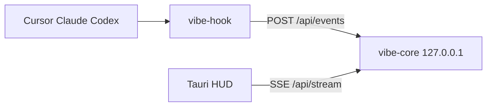
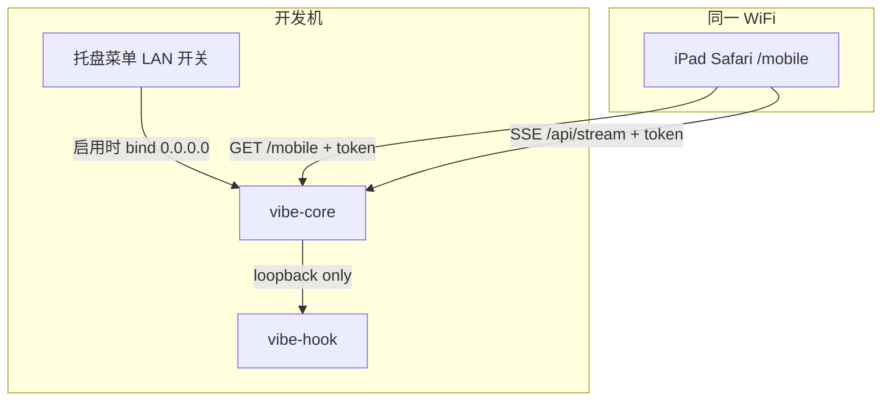

# 局域网 Companion 看板（iPad / 手机浏览器）

归档日期：2026-06-08

## 背景与目标

用户有闲置 **iPad mini 4**，希望把 Vibe Monitor 的 Agent 状态同步到该设备上，作为床头 / 桌边常驻看板。

**选定方案：方案 A — 局域网 Web 看板**

- 开发机继续运行现有 Vibe Monitor + `vibe-core`
- iPad 通过 **同一 WiFi** 的 Safari 打开精简看板页
- 数据仍 **不出局域网、不上传云端**，与产品定位一致

### 目标（In Scope）

| 项 | 说明 |
|----|------|
| 实时状态 | 通过现有 `GET /api/stream`（SSE）推送 `StatusSnapshot` |
| 只读看板 | iPad 仅展示状态，不触发 hook 安装、不写事件 |
| 可选开启 | 默认关闭 LAN 暴露；用户在托盘菜单手动启用 |
| 简单配对 | 启用后展示带 token 的 URL，可选 QR 码供 iPad 扫码 |
| iPad mini 4 兼容 | 目标 Safari / iOS 15；不依赖 Wake Lock、Service Worker 等新 API |

### 非目标（Out of Scope，首版不做）

- 原生 iOS App、App Store 分发
- 跨公网访问（Tailscale / 内网穿透另立方案）
- iPad 端修改默认来源、安装 hook、运行诊断
- 多设备账号体系、云端同步
- 历史会话回放、图表统计

---

## 现状与约束



| 现状 | 影响 |
|------|------|
| `vibe-core` 仅绑定 `127.0.0.1` | 局域网设备无法连接 |
| API 已有 `StatusSnapshot` + SSE | 看板可直接复用，无需新数据模型 |
| `CorsLayer::permissive()` 已启用 | 浏览器跨源访问无额外障碍 |
| `state.json` 已有持久化模式 | 可扩展 `lan_companion` 配置段 |
| HUD 源选择逻辑在 Rust + TS 各有一份 | 看板应 **以 Rust `pick_display_source` 为准**（见下文 API 扩展） |

**iPad mini 4 限制（iOS 15.x）**

- ✅ `EventSource`（SSE）、`fetch`、添加到主屏幕、全屏浏览
- ❌ Screen Wake Lock API（需 iOS 16.4+）→ 引导用户调长自动锁定或开启「引导式访问」
- ⚠️ 后台标签页 SSE 可能被节流 → 前台常驻时可接受；断线自动重连 + 轮询兜底

---

## 总体架构（目标态）



### 绑定策略

| `lan_companion.enabled` | 监听地址 | 说明 |
|---------------------------|----------|------|
| `false`（默认） | `127.0.0.1:port` | 与现网行为完全一致 |
| `true` | `0.0.0.0:port` | 局域网可访问；`vibe-hook` 仍 POST 到 `127.0.0.1:port`，不受影响 |

**切换启用状态需重启 `vibe-core` 监听**（托盘开关保存配置后提示重启或自动重启 embedded server）。首版可在 Tauri 侧重载 `RunningServer`。

---

## 安全模型

原则：**读接口可对 LAN 开放（带 token），写接口永远仅本机。**

### 路由分级

| 路由 | 本机 loopback | 局域网（需 token） | 说明 |
|------|---------------|-------------------|------|
| `GET /mobile` | ✅ 免 token | ✅ 需 token | 看板 HTML |
| `GET /api/stream` | ✅ 免 token | ✅ 需 token | SSE |
| `GET /api/status` | ✅ 免 token | ✅ 需 token | 轮询兜底 |
| `GET /api/lan-info` | ✅ 仅本机 | ❌ 403 | 返回 URL、token、本机 LAN IP（供托盘展示） |
| `POST /api/events` | ✅ | ❌ 403 | hook 上报 |
| `POST /api/install-hooks` | ✅ | ❌ 403 | |
| `GET /api/doctor` | ✅ | ❌ 403 | 避免泄露本机路径等信息 |

### Token

- 首次启用 LAN 时生成 **32 字节随机 hex**（`uuid` 或 `rand`），写入 `state.json`
- 传输方式：查询参数 `?token=...`（Safari 添加到主屏幕时 URL 含 token，体验最简单）
- 无效 token → `401 Unauthorized`（JSON `{"error":"unauthorized"}`）
- 托盘菜单提供 **「重新生成 token」**（旧 iPad 书签失效）

### 识别 loopback

```rust
// 伪代码：判定是否本机请求
fn is_loopback(addr: IpAddr) -> bool {
    matches!(addr, IpAddr::V4(v) if v.is_loopback())
        || matches!(addr, IpAddr::V6(v) if v.is_loopback())
}
```

Axum 通过 `ConnectInfo<SocketAddr>` 或 `tower::util::MapRequest` 注入客户端 IP。

---

## 配置持久化

扩展 `crates/vibe-core/src/state.rs` 中 `PersistedState`：

```json
{
  "lite_mode": true,
  "default_source": "cursor",
  "presentation": "float",
  "lan_companion": {
    "enabled": false,
    "token": "a1b2c3..."
  }
}
```

| 字段 | 类型 | 默认 | 说明 |
|------|------|------|------|
| `lan_companion.enabled` | `bool` | `false` | 是否绑定 `0.0.0.0` |
| `lan_companion.token` | `string?` | 启用时自动生成 | LAN 只读鉴权 |

新增 `load_lan_companion()` / `write_lan_companion()` / `ensure_lan_token()`。

---

## API 扩展

### `GET /api/lan-info`（仅 loopback）

供桌面托盘展示配对信息，不暴露给局域网。

```json
{
  "enabled": true,
  "port": 17392,
  "token": "…",
  "urls": [
    "http://192.168.1.42:17392/mobile?token=…",
    "http://10.0.0.5:17392/mobile?token=…"
  ]
}
```

- `urls`：枚举非 loopback 的 IPv4 私网地址（`192.168.x.x`、`10.x.x.x`、`172.16–31.x.x`）
- 实现：依赖 `if-addrs` 或 `local-ip-address` crate 扫描接口

### `GET /api/display`（可选，建议做）

避免移动端重复实现 `pick_display_source` 逻辑，返回 HUD 同源的单条摘要：

```json
{
  "source": "cursor",
  "source_label": "Cursor",
  "phase": "active",
  "phase_label": "进行中",
  "task_title": "重构 auth 模块",
  "last_tool": "Read",
  "detail": "Read · 重构 auth 模块",
  "updated_at": "2026-06-08T12:00:00Z"
}
```

实现：复用 `state::pick_display_source` + 与 `lib.rs` 中 `status_line` / `status_detail` 相同的文案逻辑（建议将文案函数下沉到 `vibe-core::state` 或新模块 `vibe-core::display`，供 Tauri 与 API 共用）。

**SSE 仍推送完整 `StatusSnapshot`**；`/api/display` 用于首屏快速渲染或后续轻量客户端。

---

## 移动端看板 UI

### 技术选型

**首版：单文件静态页**（HTML + CSS + 原生 JS），由 `vibe-core` 内嵌提供（`include_str!` 或 `rust-embed`），**不**走 Tauri/Vite 构建链。

理由：

- 页面简单，无需 React 运行时
- `vibe-core` 独立可测（`cargo test` + `curl`）
- iPad mini 4 上包体更小、加载更快

路径：`GET /mobile`（`/` 可 302 到 `/mobile`，仅 LAN 启用时）

### 信息架构

```
┌─────────────────────────────────┐
│  ● Cursor          进行中        │  ← 主卡片：相位色点 + 来源 + 相位文案
│                                 │
│  重构 auth 模块                  │  ← task_title（大字，可多行省略）
│  最近工具 · Read                 │  ← last_tool（小字）
├─────────────────────────────────┤
│  Cursor    ● 进行中              │
│  Claude    ○ 空闲                │  ← 三端一览
│  Codex     ○ 未知                │
├─────────────────────────────────┤
│  已连接 · 12:34:56               │  ← 连接状态 / 最后更新时间
└─────────────────────────────────┘
```

### 视觉与交互

| 元素 | 规范 |
|------|------|
| 相位色 | 与 HUD 一致：`active` 绿、`waiting_user` 琥珀、`idle` 灰、`stopped` 红、`unknown` 紫灰 |
| `waiting_user` | 卡片边框脉冲动画；可选短促提示音（`AudioContext`，需用户首次点击页面解锁） |
| 字体 | 系统字体栈 `-apple-system`；主标题 `clamp(1.5rem, 5vw, 2.5rem)` |
| 主题 | 默认深色背景（床头场景）；`prefers-color-scheme` 可跟随系统 |
| 竖屏 | 针对 iPad mini 4 竖屏 768×1024 优化；横屏同样可用 |

### 数据刷新

```javascript
// 伪代码
const token = new URLSearchParams(location.search).get("token");
const es = new EventSource(`/api/stream?token=${encodeURIComponent(token)}`);
es.onmessage = (ev) => render(JSON.parse(ev.data));
es.onerror = () => { es.close(); startPolling(); };

// 兜底：每 5s GET /api/status?token=...
```

### 添加到主屏幕（PWA 轻量）

在 HTML `<head>` 中：

```html
<meta name="apple-mobile-web-app-capable" content="yes">
<meta name="apple-mobile-web-app-status-bar-style" content="black-translucent">
<meta name="viewport" content="width=device-width, initial-scale=1, viewport-fit=cover">
<link rel="apple-touch-icon" href="/mobile-icon.png">
```

首版 **不做** Service Worker 离线缓存（iOS 15 支持有限，且状态必须在线）。

### 无 token / token 错误

- 缺少 token：展示简短说明页「请在 Mac 托盘菜单开启 iPad 看板并扫描 QR」
- 401：同上 + 「token 无效或已轮换，请重新配对」

---

## 桌面端（Tauri）改动

### 托盘菜单

在现有菜单中增加分组（建议放在「展示方式」下方）：

| 菜单项 | 类型 | 行为 |
|--------|------|------|
| 启用 iPad 看板 | `CheckMenuItem` | 切换 `lan_companion.enabled`，重载 server |
| 复制看板链接 | `MenuItem` | 调用 `GET /api/lan-info`，复制首个 URL 到剪贴板 |
| 显示配对二维码 | `MenuItem` | 弹窗展示 QR（可用 `qrcode` Rust crate 生成 PNG） |
| 重新生成 token | `MenuItem` | 确认后轮换 token，刷新菜单展示的 URL |

启用且成功绑定后，菜单首行或子行可显示：`iPad 看板 · 192.168.x.x:17392`（禁用则灰显「未启用」）。

### Tauri Commands（可选）

| Command | 说明 |
|---------|------|
| `get_lan_companion` | 返回 enabled、urls（前端设置页用） |
| `set_lan_companion_enabled` | 启用/禁用 + 触发 server 重载 |

若托盘菜单足够，首版可仅用 HTTP `GET /api/lan-info` + 托盘事件，不强制新增 command。

### Server 重载

`apps/desktop/src-tauri/src/lib.rs` 中 `AppState.runtime` 持有 `RunningServer`：

1. `stop()` 现有 server
2. 读取最新 `lan_companion` 配置
3. `vibe_core::server::start(...)` 重新绑定

需在切换期间保证 hook 上报短暂失败可接受（<1s），或做端口保持不变的重绑。

---

## 实现分期

### Phase 1 — 网络与安全基础（可独立验证）

**文件**

- `crates/vibe-core/src/server.rs` — 按配置选择 `127.0.0.1` / `0.0.0.0`
- `crates/vibe-core/src/state.rs` — `lan_companion` 持久化
- `crates/vibe-core/src/api.rs` — 鉴权 middleware、`/api/lan-info`
- 新模块 `crates/vibe-core/src/lan.rs` — loopback 判定、token 校验、IP 枚举

**验证**

```bash
# 启用后，从另一台设备（或模拟 LAN IP）
curl -H "Host: ..." "http://<lan-ip>:17392/api/status?token=..."
curl "http://127.0.0.1:17392/api/events" -X POST ...   # 仍可用
curl "http://<lan-ip>:17392/api/events" -X POST ...    # 403
```

### Phase 2 — 移动看板页

**文件**

- `crates/vibe-core/assets/mobile/index.html`（内嵌）
- `crates/vibe-core/assets/mobile/icon-180.png`（可选）
- `api.rs` — `GET /mobile` 路由

**验证**

- iPad Safari 打开 URL，状态随 Agent 活动实时变化
- 断开 WiFi 后显示「已断开」，恢复后自动重连

### Phase 3 — 托盘配对体验

**文件**

- `apps/desktop/src-tauri/src/lib.rs` — 菜单项、server 重载、复制链接
- 可选：`apps/desktop/src-tauri/Cargo.toml` 增加 `qrcode` 依赖

**验证**

- 勾选启用 → 防火墙弹窗（macOS）允许入站 → iPad 可访问
- 复制链接 / 扫码 → 主屏幕添加 → 全屏看板

### Phase 4 — 打磨（可后续迭代）

- `GET /api/display` 下沉文案逻辑，减少移动端重复
- `waiting_user` 提示音 + 托盘「静音看板」开关
- 文档：README「iPad 看板」章节、防火墙说明
- `doctor` 增加 `lan_companion_enabled` 诊断项

---

## 测试计划

### 单元测试（`vibe-core`）

| 用例 | 说明 |
|------|------|
| `is_loopback` | IPv4/IPv6 loopback |
| `lan_auth_middleware` | 无 token / 错 token / 正确 token |
| `post_from_lan_rejected` | 非 loopback POST → 403 |
| `lan_info_lists_private_ips` | mock 网卡地址 |
| `bind_address_from_config` | enabled/disabled 对应地址 |

### 集成测试

- 启动 test server（`enabled: true`，`port: 0` 随机）
- `reqwest` 从本机用 LAN IP 访问（若 CI 环境无 LAN，用 `127.0.0.1` 模拟并测 middleware 分支）

### 手动验证清单（实机）

1. **默认关闭**：iPad 无法访问开发机端口
2. **启用**：iPad 扫码打开，相位与 Mac HUD 一致
3. **waiting_user**：iPad 卡片进入等待态（脉冲 / 可选声音）
4. **token 轮换**：旧 URL 401，新 URL 可用
5. **禁用 LAN**：iPad 立即无法连接（连接中断）
6. **防火墙**：macOS / Windows 首次启用提示说明
7. **多会话**：Codex 活跃时 HUD 切到 Codex，iPad 同步

---

## 防火墙与网络说明（用户文档摘要）

| 平台 | 说明 |
|------|------|
| macOS | 首次绑定 `0.0.0.0` 时系统可能弹出「接受传入连接」，需允许 |
| Windows | 可能需在「专用网络」放行 Vibe Monitor |
| 路由器 | 无需端口转发；仅限同一局域网 |

**不建议** 将 `17392` 端口映射到公网。

---

## 风险与对策

| 风险 | 对策 |
|------|------|
| LAN 暴露扩大攻击面 | 默认关闭 + 强 token + 写接口仅 loopback |
| token 在 URL 中泄露（Referer、日志） | 仅 HTTP 局域网使用；文档提醒勿分享链接；可后续支持 `Authorization` header |
| 启用后 hook 短暂中断 | 重载 server 尽量 <500ms；保持端口不变 |
| iOS 15 后台 SSE 暂停 | 文档说明作「前台看板」使用 |
| `pick_display_source` 双份实现漂移 | Phase 4 统一 Rust 侧 `/api/display` |

---

## 关键文件一览（预计）

| 路径 | 变更 |
|------|------|
| `crates/vibe-core/src/server.rs` | 条件绑定地址 |
| `crates/vibe-core/src/state.rs` | `lan_companion` 配置 |
| `crates/vibe-core/src/api.rs` | 中间件、新路由 |
| `crates/vibe-core/src/lan.rs` | **新建** 鉴权与 IP 工具 |
| `crates/vibe-core/assets/mobile/*` | **新建** 看板静态资源 |
| `apps/desktop/src-tauri/src/lib.rs` | 托盘菜单、server 重载 |
| `docs/architecture.md` | 补充 LAN companion 小节 |
| `README.md` | 用户使用说明 |

---

## 后续扩展（不在首版）

- Tailscale IP 绑定提示（方案 B 衔接）
- mDNS 发现：`vibe-monitor.local` 免记 IP
- 多房间 / 多 token（家人各自 iPad）
- Web Push / Bark 在 `waiting_user` 时推送到 iPad（即使未打开 Safari）

---

## 验收标准（Definition of Done）

1. 托盘可开关「iPad 看板」，偏好写入 `state.json` 并重启后保留
2. 启用后 iPad Safari 通过 `http://<lan-ip>:<port>/mobile?token=...` 实时看到与 HUD 一致的相位与任务标题
3. 局域网无法 `POST /api/events` 或调用 `install-hooks` / `doctor`
4. `cargo test -p vibe-core` 与 `npm run build` 通过
5. `docs/architecture.md` 与 README 已更新配对步骤
