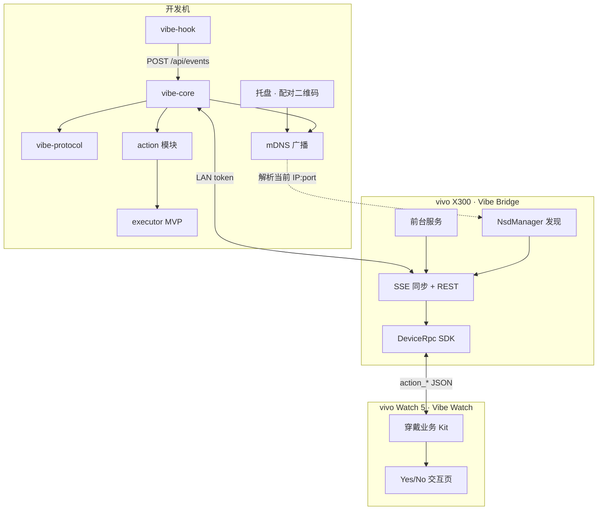

# 手表伴侣（vivo X300 + Watch 5 · Agent 确认）

归档日期：2026-06-27

## 背景与目标

用户在 **vivo X300** 与 **vivo Watch 5** 上希望接收 Vibe Monitor 转发的 **AI Agent 待确认通知**（`waiting_user`），并在手表上完成 **Yes / No**（或等价）操作，回传至开发机。

**选定方案：路线 A — Vibe Monitor 扩展（非通用系统通知镜像）**

- 开发机继续运行 Vibe Monitor + `vibe-core`（业务大脑）
- 手机 App 作 **LAN 桥接 + 保活 + vivo 互联中继**
- 手表 BlueOS App 作 **交互 UI**
- 数据 **不出公网、不上传云端**；手机与 PC **长期在同一家庭/办公室 WiFi**

### 目标（In Scope · MVP）

| 项 | 说明 |
|----|------|
| 动作推送 | `waiting_user` 时生成 `PendingAction`，经 SSE 推到手机再转发手表 |
| 手表交互 | 振动 + 标题/摘要 + 最多 2 个主按钮（允许/拒绝） |
| 回执回传 | 手表 → 手机 DeviceRpc → PC `POST /api/actions/{id}/respond` |
| 动态寻址 | **不依赖固定 PC IP**；mDNS 服务发现 + 扫码配对兜底 |
| PC 执行器 MVP | 桌面通知 + **剪贴板预填回复** + 日志（一步到位，半自动） |

### 非目标（Out of Scope · 首版不做）

- 通用系统通知镜像（微信、短信等）
- 跨公网 / Tailscale / 内网穿透（用户确认同 WiFi，暂不需要）
- PC 端全自动点击 IDE 确认（Hook/MCP 注入属 V2+）
- 多 PC、多手表账号体系
- 历史动作回放、统计图表
- vivo 应用商店正式上架（首版侧载 debug 包自测）

---

## 设备与平台约束

| 设备 | 系统 | 开发语言 | SDK |
|------|------|---------|-----|
| 开发机 | macOS / Linux / Windows | Rust + TypeScript | 现有 `vibe-core` / Tauri |
| vivo X300 | OriginOS (Android) | **Kotlin** | vivo 智能终端设备 SDK (Java AAR) |
| vivo Watch 5 | BlueOS | **JavaScript** | BlueOS Studio + 穿戴业务 Kit |

- 手机需安装 **vivo 运动健康**（BlueXlink 互联底座依赖）
- 手表互联官方文档以 Watch 3 为参考，Watch 5 需 **真机 POC 验证** DeviceRpc 兼容性
- OriginOS 后台限制严格：手机 Bridge 必须 **前台服务 + 电池白名单引导**

---

## 总体架构



### 数据流（一次确认）

1. Agent hook 上报 → `vibe-core` 判定 `waiting_user`
2. `action` 模块创建 `PendingAction`（`binary_choice`）
3. SSE 推送 `action_created` → 手机 Bridge 收到
4. 手机经 DeviceRpc 转发 `action_prompt` → 手表振动并展示
5. 用户点选 → 手表 `action_response` → 手机 → PC `POST respond`
6. `executor` 触发桌面通知、将建议回复写入剪贴板，并写日志

---

## 语言与仓库结构

```
workspace/
├── crates/
│   ├── vibe-protocol/      # 新建：跨端 JSON 类型（serde 唯一真相源）
│   ├── vibe-core/          # 扩展：action API、executor、mDNS
│   └── vibe-hook/          # 不变
├── apps/
│   ├── desktop/            # 扩展：手表伴侣设置、配对二维码
│   ├── bridge-android/     # 新建：Kotlin 手机桥接
│   └── watch-blueos/       # 新建：BlueOS 手表应用
└── docs/plans/
    └── watch-companion.md  # 本文档
```

| 端 | 语言 | 不选用的原因 |
|----|------|-------------|
| PC 核心 | Rust | 已有栈；动作队列/鉴权/执行器放此最稳 |
| PC UI | TypeScript + React | 仅设置页，复用 Tauri |
| 手机 | Kotlin | vivo SDK 为 Java AAR；Compose + 前台服务最可靠 |
| 手表 | JavaScript | BlueOS 平台限定 |
| ~~手机 Rust/Flutter/RN~~ | — | SDK 集成成本高 |
| ~~Tailscale~~ | — | 用户同 WiFi，MVP 不需要 |

---

## 连接与寻址（动态 IP · 同 WiFi）

### 原则

- **不持久化 PC IP**（可作短期缓存，失效即丢）
- **持久化**：`device_id`、`service_name`、`token`、`host_fallback`（可选）
- token **不写入 mDNS TXT**（防局域网嗅探）；仅通过扫码交给手机

### 主路径：mDNS 服务发现

```
PC 注册:
  服务类型: _vibe-monitor._tcp.local
  实例名:   vibe-monitor-{device_id}._tcp.local
  端口:     17392（或当前 port）
  TXT:      device_id, version

手机连接:
  1. NsdManager.discoverServices("_vibe-monitor._tcp")
  2. 匹配 device_id → resolveService → 得当前 IP:port
  3. GET /api/status?token=... 健康检查
  4. 建立 SSE /api/stream?token=...
```

PC 在 **启动、LAN 启用、网卡/IP 变化** 时重新注册 mDNS。

手机在 **SSE 断线** 时：重新 mDNS 解析 → 更新 endpoint → 重连（用户无感）。

### 兜底：扫码配对

托盘展示二维码，JSON 内容：

```json
{
  "v": 1,
  "device_id": "a1b2c3",
  "service": "vibe-monitor-a1b2c3._tcp.local",
  "host_fallback": "my-dev-pc.local",
  "port": 17392,
  "token": "..."
}
```

手机连接顺序：

1. mDNS 解析 `service`
2. 失败 → `http://{host_fallback}:{port}`（若用户填了主机名）
3. 仍失败 → 提示重新扫码

### 多网卡

复用现有 `local_ipv4_addresses()` 优先级；mDNS 在所有私网接口注册；手机解析到多个地址时逐个 `GET /api/status` 试探。

### 明确不做（当前用户场景）

- Tailscale / ZeroTier overlay
- 公网中继服务器
- 写死 IP 作为唯一配对方式

---

## 协议设计（`vibe-protocol`）

### Envelope（手机 ↔ 手表 ↔ PC 共用）

```json
{
  "type": "action_prompt | action_response | action_cancelled",
  "id": "uuid",
  "ts": 1719494400,
  "data": { }
}
```

### `action_prompt`

```json
{
  "source": "cursor",
  "session_id": "abc",
  "phase": "waiting_user",
  "title": "允许执行命令？",
  "body": "npm run test",
  "actions": [
    { "id": "approve", "label": "允许", "style": "primary" },
    { "id": "deny", "label": "拒绝", "style": "destructive" }
  ],
  "expires_at": "2026-06-27T12:05:00Z"
}
```

### `action_response`

```json
{
  "action_id": "uuid",
  "choice": "approve",
  "from": "watch"
}
```

### 动作类型（可扩展）

| type | 手表 UI | MVP |
|------|---------|-----|
| `binary_choice` | 两个大按钮 | ✅ |
| `single_select` | 滚动列表 | ❌ |
| `ack` | 单按钮「知道了」 | ❌ |
| `status_only` | 无按钮 | ❌ |

### 内容安全

- 标题/正文经 `redact_title` 同类规则过滤密钥
- 动作 TTL 默认 5 分钟，过期自动 `action_cancelled`

---

## PC 端扩展（`vibe-core`）

### 新增模块

| 模块 | 职责 |
|------|------|
| `discovery/mdns.rs` | 注册/更新/注销 `_vibe-monitor._tcp` |
| `action/store.rs` | `PendingAction` 队列、过期、幂等 |
| `action/trigger.rs` | `waiting_user` → 创建 `binary_choice` |
| `action/api.rs` | REST 路由 |
| `executor/mod.rs` | `ActionExecutor` trait + 组合执行链 |
| `executor/notify.rs` | 桌面通知 + 日志 |
| `executor/clipboard.rs` | 按选择写入剪贴板（`y`/`n` 等） |

### 新增 API

| 方法 | 路径 | LAN | 说明 |
|------|------|-----|------|
| GET | `/api/actions/pending` | token | 拉取未过期待处理动作 |
| POST | `/api/actions/{id}/respond` | token | 提交用户选择 |
| GET | `/api/stream` | token | 扩展事件：`action_created`、`action_resolved` |

写接口安全模型与现有 LAN 看板一致：**非 loopback 的 POST 需 token**（扩展 `lan_guard`）。

### Executor（MVP 一步到位）

手表回执到达 PC 后，**同时**执行通知与剪贴板（`CompositeExecutor` 串联，不拆阶段）：

| 步骤 | 行为 |
|------|------|
| 1 | 桌面通知：「你在手表上选择了：允许」+ 会话摘要 |
| 2 | 剪贴板：写入该选择对应的建议回复文本 |
| 3 | 日志：记录 `action_id`、`choice`、`clipboard_text` |

**剪贴板映射（默认，`binary_choice`）**

| 选择 `choice` | 剪贴板内容 | 说明 |
|---------------|-----------|------|
| `approve` | `y` | 终端 `(y/n)` 最常见 |
| `deny` | `n` | 同上 |

通知正文附带：**「建议回复已复制，回到终端粘贴后回车」**。

后续可按 `source` 扩展映射（如 Claude 用 `yes`/`no`），MVP 先统一 `y`/`n`。

| 阶段 | 实现 | 说明 |
|------|------|------|
| **MVP** | `NotifyExecutor` + `ClipboardExecutor` | 通知 + 剪贴板 + 日志 |
| V2 | `HookExecutor` | Cursor hook / MCP 程序化注入（真正自动确认） |

```rust
trait ActionExecutor {
    fn on_response(&self, action: &PendingAction, choice: &str) -> Result<()>;
}
```

MVP 注册 `CompositeExecutor(vec![Notify, Clipboard])`；V2 再追加或替换为 `HookExecutor`。

### 桌面 UI（Tauri）

- 托盘/设置：**启用手表伴侣**（复用 `lan_companion.enabled` 或独立开关，实现时二选一）
- 展示 **配对二维码**（含 `device_id`、`service`、`token`）
- 连接状态：是否有手机 SSE 订阅、最近回执

---

## 手机端（`bridge-android` · Kotlin）

### 技术栈

- UI：Jetpack Compose（设置、连接状态）
- 网络：OkHttp + SSE
- 发现：`NsdManager`
- 持久化：DataStore（配对信息）、Room（离线动作队列，可选）
- 保活：`ForegroundService` + 通知渠道
- 手表：vivo `DeviceRpcManager`
- 并发：Kotlin Coroutines + Flow

### 职责边界

| 做 | 不做 |
|----|------|
| mDNS 发现 PC、维护 SSE | 解析 hook 事件、判断 `waiting_user` |
| 转发 `action_prompt` / `action_response` | 直连 PC（必须经 LAN HTTP） |
| 断线重连、离线队列 | 业务规则与过期策略（以 PC 为准） |

### 权限

- `INTERNET`
- `FOREGROUND_SERVICE` / `FOREGROUND_SERVICE_DATA_SYNC`
- `POST_NOTIFICATIONS`（Android 13+）
- `ACCESS_NETWORK_STATE`
- `CHANGE_WIFI_MULTICAST_STATE`（mDNS）

### OriginOS 适配

- 首次启动引导：通知权限、电池优化白名单、vivo 运动健康已安装
- 前台服务常驻通知，避免杀后台导致漏推送

---

## 手表端（`watch-blueos` · JavaScript）

### 技术栈

- BlueOS Studio，`.ux` 页面
- 穿戴业务 Kit：`connectionManager` / interconnect API
- 本地 `storage` 缓存未确认动作

### 页面

| 页面 | 说明 |
|------|------|
| 空闲 | 显示「已连接 / 等待任务」 |
| 确认 | 标题 + 可滚动正文 + 2 按钮 |
| 过期 | 「已超时」+ 返回 |

### 交互

- 收到 `action_prompt`：振动 + 跳转确认页
- 圆形屏：主按钮最多 2 个，正文超长滚动
- 不直连 PC，仅与手机 App 通信

---

## 安全模型

| 层级 | 措施 |
|------|------|
| 发现 | mDNS 仅广播 `device_id` + 端口，不含 token |
| 鉴权 | 现有 `lan_companion.token`；`Authorization: Bearer` 或 query |
| 写操作 | `POST respond` 需 token；动作 id 一次性 + TTL |
| 内容 | `redact_title` 过滤敏感字段 |
| 范围 | 仅 RFC1918 / 链路本地；写接口不对公网开放 |

---

## MVP 验收标准

1. PC 启用 LAN + 手表伴侣，托盘展示二维码；手机扫码配对成功（无需手写 IP）
2. 路由器 DHCP 刷新导致 PC IP 变化后，手机 **无需重新扫码** 即可自动重连
3. Cursor Agent 进入 `waiting_user` 后 **10 秒内** 手表振动并显示确认 UI
4. 手表点「允许」→ PC API 记录回执 → 桌面通知 + 剪贴板已为 `y`
5. PC 休眠/离线时，手机显示「开发机离线」；唤醒后自动恢复
6. 动作超时后手表显示过期，PC 侧动作自动清理

---

## 实施顺序

| 步骤 | 内容 | 语言 |
|------|------|------|
| 1 | `vibe-protocol` crate + 类型测试 | Rust |
| 2 | `vibe-core` action store + API + SSE 事件 | Rust |
| 3 | `vibe-core` mDNS 注册 + 网卡变化重注册 | Rust |
| 4 | 桌面配对二维码 + 伴侣开关 UI | TypeScript |
| 5 | Android：扫码配对 + mDNS + SSE 连接（日志验证） | Kotlin |
| 6 | BlueOS：互联 POC + 确认页 UI | JavaScript |
| 7 | 端到端 yes/no 回传 | 联调 |
| 8 | `NotifyExecutor` + `ClipboardExecutor` + OriginOS 保活打磨 | Rust + Kotlin |

**第 6 步应尽早用 Watch 5 真机验证 DeviceRpc。**

---

## 风险与缓解

| 风险 | 缓解 |
|------|------|
| Watch 5 与 Watch 3 SDK 差异 | 第 6 步真机 POC；不通过则查 vivo 开发者支持 |
| mDNS 被路由器禁用 | 扫码兜底；同 WiFi 家庭路由通常可用 |
| OriginOS 杀 Bridge | 前台服务 + 白名单引导 |
| Agent 无法自动确认 | MVP 接受半自动；V2 HookExecutor |
| `waiting_user` 误触发过多 | 合并同 session 重复动作；节流 |

---

## 与现有 LAN 看板的关系

| 项 | LAN 看板 (`/mobile`) | 手表伴侣 |
|----|---------------------|---------|
| 用途 | 只读状态展示 | 可读 + **写回执** |
| 客户端 | 浏览器 | 原生手机 + 手表 |
| 寻址 | 当前为 IP URL | **mDNS + 扫码**（看板可后续复用 mDNS） |
| 开关 | `lan_companion.enabled` | 依赖 LAN 绑定；实现时可共用开关 |

---

## 外部依赖清单

- [ ] vivo 开放平台账号
- [ ] 创建应用，获取 AppID + 智能终端 SDK 密钥
- [ ] BlueOS Studio 安装
- [ ] 手机安装 vivo 运动健康
- [ ] 真机：X300 + Watch 5

---

## 已确认项

| 项 | 决策 |
|----|------|
| 连接 | 同 WiFi + mDNS，不做 Tailscale |
| Executor MVP | **通知 + 剪贴板** 一步到位（`y`/`n`） |
| 自动点 IDE | V2 `HookExecutor`，MVP 不做 |

## 待定项（实现前确认）

1. **开关模型**：手表伴侣是否与 `lan_companion` 共用同一开关，还是独立 `watch_companion.enabled`？
